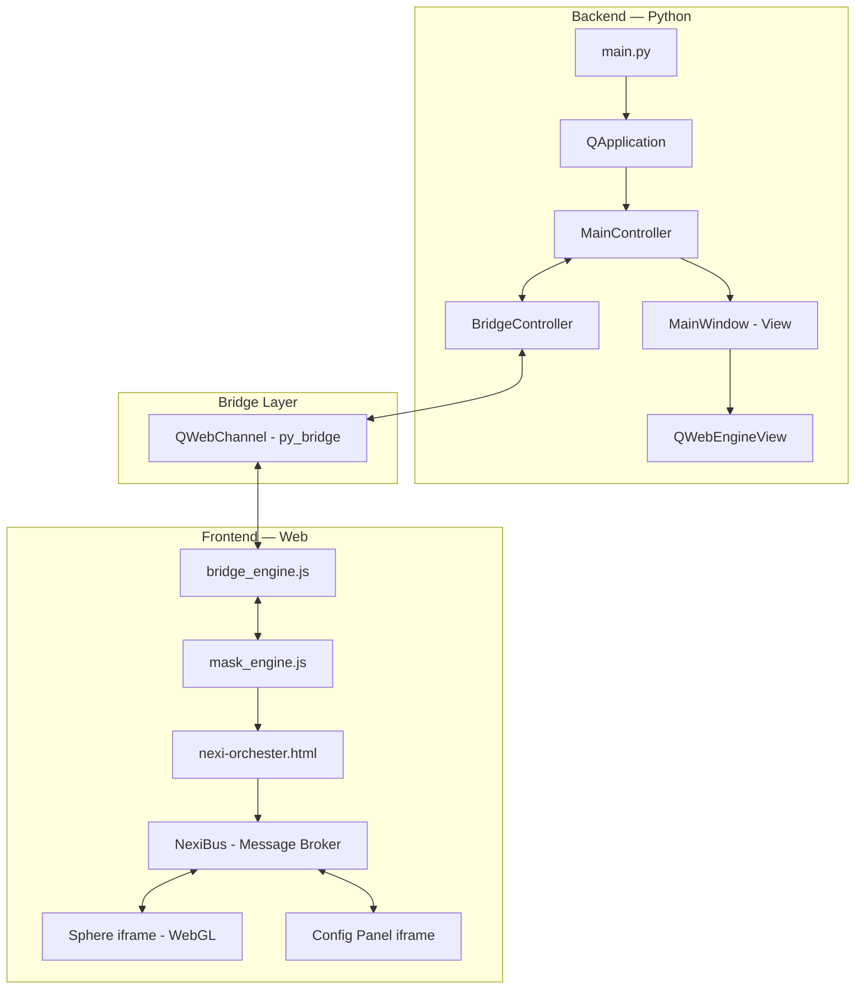

#  Nexi — Next-Gen Desktop Assistant

> A modern, animated desktop assistant inspired by classic helpers like Clippy and J.A.R.V.I.S. — redesigned with a sleek UI, real-time 3D visuals, and a high-performance hybrid architecture.

<p align="center">
  
  
  
  
  
</p>

---

## ✨ What is Nexi?

**Nexi** is a lightweight, cross-platform desktop assistant that lives on your screen as an interactive 3D sphere. It combines a native Python backend (PySide6/Qt) with a web-based frontend (HTML/CSS/JS + WebGL) to deliver a fluid, visually rich experience with minimal resource consumption.

Unlike traditional assistants, Nexi uses a **scene-based orchestration system** where multiple UI "characters" (the sphere, a drag handle, a context menu, a config panel) are composed into scenes. Each scene defines which elements are visible and clickable through **dynamic window masks** — making only the relevant parts of the overlay interactive while the rest of the screen remains fully accessible.

---

## 🎯 Key Features

- **3D WebGL Sphere** — An animated, interactive sphere rendered in real-time via WebGL inside a Chromium-based view.
- **Hybrid Architecture** — Native PySide6 window with an embedded QWebEngineView for maximum flexibility.
- **Scene Orchestration** — A central orchestrator manages multiple UI characters (sphere, drag handle, context menu, config panel) and dynamically composes them into scenes.
- **Dynamic Window Masking** — Python-side `QRegion` masks are pre-calculated per scene so only the visible UI elements receive input, while the rest of the screen passes through.
- **Drag & Drop** — Grab the satellite drag handle to freely reposition Nexi on your screen.
- **Context Menu** — Right-click the sphere for quick access to settings and controls.
- **NexiBus Message System** — A high-reliability, bidirectional message bus with ACK/NACK confirmations, retry logic, and delivery queuing between iframe components.
- **QWebChannel Bridge** — Seamless Python ↔ JavaScript communication via Qt's WebChannel protocol.
- **Single Instance Lock** — Prevents multiple instances via shared memory.
- **PyInstaller Ready** — Includes `resource_path()` helper for compatibility with frozen executables.

---

## 🏗️ Architecture

Nexi follows an **MVC (Model-View-Controller)** pattern with a bridge layer for cross-language communication:



### Communication Flow

1. **Startup** → `main.py` creates the Qt app, view, and controllers.
2. **HTML Load** → The orchestrator HTML is loaded with injected JS modules (`nexi_bus.js`, `mask_engine.js`, `bridge_engine.js`).
3. **Handshake** → JavaScript signals readiness via `QWebChannel` → Python confirms with `on_python_ready()`.
4. **Scene Updates** → `mask_engine.js` collects geometry data from all characters and sends it to Python as an `update` message.
5. **Scene Changes** → When the user interacts (hover, right-click, open config), a `change` message tells Python which scene to activate.
6. **Mask Application** → Python pre-calculates `QRegion` masks for each scene and applies them to the native window, making only the active elements receive input.

---

## 📁 Project Structure

```
nexi-1.7.0.0/
├── main.py                          # Application entry point
├── info.json                        # Build & environment metadata
├── nexi.version                     # Version descriptor
├── requirements.txt                 # Python dependencies
├── .gitignore                       # Git ignore rules
│
├── nexi_app/                        # Core application package
│   ├── controller/
│   │   ├── main_controller.py       # MVC Controller — app logic & mask management
│   │   └── bridge_controller.py     # QWebChannel bridge (Python ↔ JS)
│   ├── model/
│   │   └── settings_model.py        # Data/settings model
│   ├── view/
│   │   └── main_window.py           # MVC View — native window & WebEngine
│   ├── utils/
│   │   ├── helpers.py               # resource_path(), single-instance lock
│   │   ├── hit_test_filter.py       # Input filtering utilities
│   │   ├── log.py                   # Logging system
│   │   └── system_info.py           # Hardware/OS info collector
│   └── tests/                       # Test files & HTML prototypes
│
└── resources/
    ├── templates/
    │   └── log_viewer_template/     # HTML log viewer (index.html, script.js, style.css)
    └── web_designs/
        ├── nexi-orchester/          # 🎭 Scene Orchestrator
        │   ├── nexi-orchester.html  # Main orchestrator — manages all characters
        │   ├── config_panel.html    # Settings panel UI
        │   └── js/
        │       ├── nexi_bus.js      # Inter-component message bus (ACK, retries, queue)
        │       ├── mask_engine.js   # Geometry collector & mask sync with Python
        │       └── bridge_engine.js # QWebChannel handshake & protocol layer
        ├── sphere/                  # 🔮 3D Sphere designs (WebGL, Canvas iterations)
        └── ring/                    # 💍 Ring/Torus design prototypes
```

---

## 🛠️ Tech Stack

| Layer | Technology | Version |
|:------|:-----------|:--------|
| **Language** | Python | 3.13 |
| **Native UI** | PySide6 (Qt for Python) | 6.9.1 |
| **Web Rendering** | QWebEngineView (Chromium) | — |
| **3D Graphics** | WebGL + Canvas | — |
| **Messaging** | NexiBus (custom event broker) | — |
| **Bridge** | QWebChannel | — |
| **System Info** | psutil, WMI, pywin32 | — |
| **Packaging** | PyInstaller | — |

---

## 🚀 Getting Started

### Prerequisites

- **Python 3.13+**
- **pip** (bundled with Python)
- **Windows 10/11** (primary target; macOS/Linux support is experimental)

### Installation

```bash
# Clone the repository
git clone https://github.com/lewopxd/nexi-1.7.0.0.git
cd nexi-1.7.0.0

# Create a virtual environment
python -m venv .venv

# Activate it
# Windows:
.venv\Scripts\activate
# macOS/Linux:
# source .venv/bin/activate

# Install dependencies
pip install -r requirements.txt
```

### Running

```bash
python main.py
```

The assistant will launch as a frameless, always-on-top overlay. A 3D sphere appears in the bottom-right corner. Hover to reveal the drag handle; right-click for the context menu.

### Building an Executable

```bash
pip install pyinstaller
pyinstaller main.spec
```

The compiled executable will be generated in the `dist/` folder.

---

## ⚙️ Configuration

Window behavior is configured via `WINDOW_CONFIG` in [`main.py`](main.py):

```python
WINDOW_CONFIG = {
    'flag_frameless': True,         # Remove window borders
    'flag_stay_on_top': True,       # Keep overlay above all windows
    'att_transparent_background': True,  # Transparent window background
    'feature_dev_tools': False,     # Enable Chrome DevTools on port 9222
    'security_margin': 1            # Pixel margin around fullscreen geometry
}
```

---

## 📐 Design Patterns

| Pattern | Usage |
|:--------|:------|
| **MVC** | `MainController` (logic) ↔ `MainWindow` (view) ↔ `SettingsModel` (data) |
| **Bridge** | `BridgeController` decouples Python logic from JS communication |
| **Observer** | Qt Signals/Slots for event-driven communication |
| **Broker** | `NexiBus` acts as a central message router between iframe components |
| **Scene Graph** | The orchestrator composes "characters" into numbered scenes with pre-computed masks |

---

## 🗺️ Roadmap

- [ ] Voice command integration
- [ ] Proactive suggestions (time, tasks, events)
- [ ] Plugin system for custom commands
- [ ] Theme customization
- [ ] Tray icon with system notifications
- [ ] macOS & Linux full support

---

## 📄 License

This project is licensed under the [MIT License](LICENSE).

---

<p align="center">
  <sub>Built with 💙 by <a href="https://github.com/lewopxd">lewopxd</a></sub>
</p>
